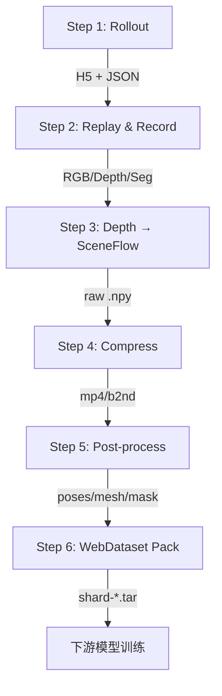

# Metaworld 仿真数采平台 — 仓库规范文档

> 适用范围：Metaworld 仿真数据采集 pipeline 及其衍生项目  
> 版本：v1.0.0 | 2026-06-02  
> 维护人：梁卓维

---

## 1. 项目概述

Metaworld 是一个基于 MuJoCo + Gymnasium 的仿真数据采集平台，核心功能包括：

- 50 个机械臂操作任务的策略 rollout
- 多视角 RGB / Depth / Segmentation 录制
- SceneFlow 点云计算与压缩
- 物体位姿 / 网格提取
- 面向下游模型（如 MIKASA-Robo）的数据格式转换与 WebDataset 打包

---

## 2. 目标目录结构

整合至 GitLab 后，仓库应遵循以下规范目录：

```
metaworld-sim-pipeline/
├── metaworld/                # 核心仿真环境包（上游 Farama Metaworld fork）
│   ├── envs/                 # 50 个任务环境定义
│   ├── policies/             # 内置脚本策略
│   ├── assets/               # MuJoCo XML 模型文件
│   └── utils/                # 工具函数
├── pipeline/                 # 数据采集 pipeline 核心代码
│   ├── rollout/              # Step 1: 策略采集
│   ├── replay/               # Step 2: 轨迹回放与录制
│   ├── sceneflow/            # Step 3-4: 点云与场景流计算/压缩
│   ├── postprocess/          # Step 5: 位姿/网格/mask 后处理
│   └── packing/              # Step 6: WebDataset 打包
├── scripts/                  # 辅助脚本（批量运行、监控、质量检查）
│   ├── run_pipeline.sh
│   ├── run_all_tasks_parallel.sh
│   └── check_sceneflow_quality.py
├── tests/                    # 测试代码
│   ├── unit/                 # 单元测试
│   ├── integration/          # 集成测试（端到端 pipeline 测试）
│   └── conftest.py
├── examples/                 # 使用示例
│   ├── collect_single_task.py
│   ├── visualize_sceneflow.py
│   └── README.md
├── packaging/                # 打包与部署
│   └── docker/
│       ├── Dockerfile
│       └── docker-compose.yml
├── docs/                     # 项目文档
│   ├── architecture.md       # 系统架构说明
│   ├── dependencies.md       # 项目间依赖关系
│   ├── interfaces.md         # 接口清单（输入输出格式）
│   ├── pipeline_conventions.md
│   ├── dataset_pipeline.md
│   └── diagrams/
│       └── pipeline_flow.mmd
├── configs/                  # 配置文件（环境参数、相机参数等）
│   ├── camera_presets.yaml
│   └── task_list.yaml
├── .gitlab-ci.yml            # CI/CD 配置
├── .pre-commit-config.yaml   # 代码格式化 hooks
├── pyproject.toml            # Python 包配置
├── Makefile                  # 常用构建命令
├── README.md                 # 项目说明
├── CONTRIBUTING.md           # 贡献指南
├── CHANGELOG.md              # 版本变更日志
└── .gitignore
```

### 2.1 目录职责说明

| 目录 | 职责 | 备注 |
|------|------|------|
| `metaworld/` | 仿真环境核心包 | 上游 fork，尽量少改动 |
| `pipeline/` | 数据采集全流程代码 | 按 step 分模块，每个模块可独立调用 |
| `scripts/` | 运维辅助脚本 | 批量执行、监控、质量检查 |
| `tests/` | 测试代码 | 单元测试 + 集成测试 |
| `examples/` | 使用样例 | 新人上手参考 |
| `packaging/` | 容器化/部署 | Dockerfile、docker-compose |
| `docs/` | 项目文档 | 架构、依赖、接口、约定 |
| `configs/` | 配置文件 | YAML 格式，不含密钥 |

### 2.2 数据目录（不入库）

以下目录通过 `.gitignore` 排除，不纳入版本控制：

```
rollout_data/         # rollout 原始轨迹（H5 + JSON）
datasets*/            # 中间处理数据
webdataset_*/         # 打包后的 shard
tmp_vis/              # 临时可视化输出
*.csv                 # 大型质量报告
```

---

## 3. 分支规范

### 3.1 长期分支

| 分支 | 说明 | 合并方向 | MR 发起人 | Approve 责任人 |
|------|------|----------|-----------|----------------|
| `main` | 稳定分支，正式发布 | test → main | 测试分管 Lead | 测试负责人 |
| `test` | 发版前测试/冻结版本 | dev → test | 小组 Lead | 测试人员 |
| `dev` | 日常集成 | feature/* → dev | 功能开发人员 | 模块负责人 |

### 3.2 临时分支命名规范

| 类型 | 命名 | 示例 | 来源 | 合入 |
|------|------|------|------|------|
| 功能 | `feature/<简短描述>` | `feature/multi-camera-replay` | dev | dev |
| 修复 | `bugfix/<简短描述>` | `bugfix/depth-nan-handling` | dev | dev |
| 紧急修复 | `hotfix/<版本号>` | `hotfix/v0.2.1` | tag | test/main |
| 重构 | `refactor/<简短描述>` | `refactor/sceneflow-module` | dev | dev |
| 文档 | `docs/<简短描述>` | `docs/pipeline-conventions` | dev | dev |

### 3.3 分支原则

1. `main` 只放稳定代码，不允许直接推送
2. 所有功能开发必须通过 Merge Request
3. 合并前必须通过 CI 测试和代码审核
4. 发布版本必须打 tag
5. 临时分支合并后及时删除

### 3.4 开发流程

```bash
# 从 dev 拉取最新代码
git checkout dev
git pull origin dev

# 创建功能分支
git checkout -b feature/multi-camera-replay

# 开发完成后推送
git push -u origin feature/multi-camera-replay

# 在 GitLab 上创建 MR → dev
# 通过 review 后合并，删除分支
```

---

## 4. Tag 版本规范

### 4.1 命名规则

```
v<主版本>.<次版本>.<修订版本>
```

| 版本位 | 变更场景 | 示例 |
|--------|----------|------|
| 主版本 | 不兼容的数据格式变更、接口重构 | v1.0.0 → v2.0.0 |
| 次版本 | 新增功能（向后兼容） | v1.0.0 → v1.1.0 |
| 修订版本 | Bug 修复、文档更新 | v1.1.0 → v1.1.1 |

### 4.2 打 tag 流程

```bash
# 确认 main 分支代码已就绪
git checkout main
git pull origin main

# 打 tag
git tag -a v0.1.0 -m "v0.1.0: 初始版本，支持 50 任务 pipeline"
git push origin v0.1.0
```

### 4.3 基于 tag 创建 hotfix

```bash
git checkout -b hotfix/v0.1.1 v0.1.0
# 修复后合并回 test 和 main，打新 tag v0.1.1
```

---

## 5. Python 代码规范

### 5.1 格式化工具链

项目已配置 pre-commit，统一使用：

| 工具 | 用途 | 版本 |
|------|------|------|
| black | 代码格式化 | 23.3.0 |
| isort | import 排序 | 5.12.0 |
| flake8 | 静态检查 | 6.0.0 |
| mypy | 类型检查 | 1.6.1 |
| pyupgrade | 语法升级 | 3.3.2 |

所有开发人员首次 clone 后执行：

```bash
pip install pre-commit
pre-commit install
```

### 5.2 代码风格要求

- 行宽：不超过 120 字符（black 配置）
- 类型标注：公共函数必须标注参数和返回值类型
- 文档字符串：公共模块/类/函数使用 Google 风格 docstring
- 命名：
  - 模块/文件：`snake_case`
  - 类：`PascalCase`
  - 函数/变量：`snake_case`
  - 常量：`UPPER_SNAKE_CASE`

### 5.3 模块组织原则

```python
# pipeline/sceneflow/flow_compress.py

"""场景流压缩模块。

将 .npy 格式的原始场景流压缩为 mp4 + json 辅助文件。
"""

from __future__ import annotations

import argparse
from pathlib import Path
from typing import TYPE_CHECKING

import numpy as np

if TYPE_CHECKING:
    from numpy.typing import NDArray
```

### 5.4 依赖管理

- 运行时依赖在 `pyproject.toml` 的 `[project.dependencies]` 中声明
- 开发依赖使用 `[project.optional-dependencies]` 分组
- 依赖版本使用最小兼容约束（`>=`），避免开放上界
- 锁定精确版本时使用 `requirements-lock.txt`（CI 用）

---

## 6. 提交规范

### 6.1 Commit Message 格式

```
<type>(<scope>): <subject>

<body>       # 可选
<footer>     # 可选
```

### 6.2 Type 枚举

| type | 说明 |
|------|------|
| `feat` | 新功能 |
| `fix` | Bug 修复 |
| `refactor` | 重构（不改变功能） |
| `docs` | 文档变更 |
| `test` | 测试相关 |
| `ci` | CI/CD 配置变更 |
| `chore` | 构建/依赖/配置等杂项 |
| `perf` | 性能优化 |

### 6.3 Scope 建议

与模块目录对应：`pipeline`, `sceneflow`, `replay`, `rollout`, `postprocess`, `packing`, `scripts`, `docs`

### 6.4 示例

```
feat(sceneflow): 支持多相机同时计算场景流

- 新增 --multi-cameras 参数
- 并行处理多视角深度图
- 输出按相机名分目录存放

Refs: #42
```

---

## 7. Merge Request 规范

### 7.1 MR 标题

简洁描述变更目的，格式与 commit message 一致：

```
feat(replay): 支持 random camera 选择
```

### 7.2 MR 描述模板

```markdown
## 变更说明
<!-- 做了什么，为什么做 -->

## 测试方式
<!-- 如何验证这个变更是正确的 -->

## 影响范围
<!-- 涉及哪些模块，是否有破坏性变更 -->

## Checklist
- [ ] 代码通过 pre-commit 检查
- [ ] 新增/修改的公共函数有类型标注
- [ ] 已补充/更新相关文档
- [ ] 已添加/更新测试
- [ ] 不含调试代码或临时文件
```

### 7.3 Review 要求

- 至少 1 名 Reviewer Approve
- CI pipeline 必须通过
- 不允许 self-merge（紧急 hotfix 除外，事后补 review）

---

## 8. 文档规范

### 8.1 必须维护的文档

| 文件 | 内容 | 更新时机 |
|------|------|----------|
| `docs/architecture.md` | 系统架构、模块关系 | 架构变更时 |
| `docs/dependencies.md` | 项目间依赖关系 | 新增外部依赖时 |
| `docs/interfaces.md` | 数据接口格式清单 | 格式变更时 |
| `docs/pipeline_conventions.md` | 坐标约定、数据格式 | 约定变更时 |
| `CHANGELOG.md` | 版本变更日志 | 每次发版时 |
| `README.md` | 项目总览、快速开始 | 功能大幅变更时 |

### 8.2 接口文档格式

`docs/interfaces.md` 应记录 pipeline 各步骤的输入输出：

```markdown
## Step 2: replay_record_trajectories

### 输入
| 文件 | 格式 | 来源 |
|------|------|------|
| trajectory.*.h5 | HDF5 | Step 1 |
| trajectory.*.json | JSON | Step 1 |

### 输出
| 文件 | 格式 | Shape/Schema |
|------|------|--------------|
| rgb.mp4 | H.264 | (T, H, W, 3) uint8 |
| depth_video.npy | NumPy | (T, H, W) float16, 单位: m |
| cam_poses.npy | NumPy | (T, 4, 4) float32, cam-to-world OpenGL |
| cam_intrinsics.npy | NumPy | (3, 3) float32 |
```

---

## 9. CI/CD 规范

### 9.1 基础 Pipeline 阶段

```yaml
stages:
  - lint        # 代码格式检查
  - test        # 单元测试 + 集成测试
  - build       # 打包
  - deploy      # 部署（仅 tag 触发）
```

### 9.2 最小 .gitlab-ci.yml 示例

```yaml
image: python:3.10

stages:
  - lint
  - test

variables:
  PIP_CACHE_DIR: "$CI_PROJECT_DIR/.cache/pip"

cache:
  paths:
    - .cache/pip

lint:
  stage: lint
  script:
    - pip install pre-commit
    - pre-commit run --all-files
  rules:
    - if: $CI_MERGE_REQUEST_IID

test:
  stage: test
  script:
    - pip install -e ".[testing]"
    - pytest tests/ -v --tb=short
  rules:
    - if: $CI_MERGE_REQUEST_IID
    - if: $CI_COMMIT_TAG
```

---

## 10. Makefile 常用命令

```makefile
.PHONY: install lint test pipeline clean

install:
	pip install -e ".[dev,testing]"
	pre-commit install

lint:
	pre-commit run --all-files

test:
	pytest tests/ -v --tb=short

pipeline:
	bash scripts/run_pipeline.sh

clean:
	find . -type d -name __pycache__ -exec rm -rf {} +
	find . -type f -name "*.pyc" -delete
```

---

## 11. 当前仓库迁移 Checklist

基于当前 Metaworld 仓库状态，迁移至 GitLab 规范需要完成：

### 11.1 目录重组

- [ ] 将 `rbs_sceneflow_scripts/` 代码迁移至 `pipeline/` 按步骤分模块
- [ ] 将根目录下的 `vis_*.py` 移入 `scripts/` 或 `examples/`
- [ ] 将根目录下的 `run_*.sh` / `test_*.sh` 移入 `scripts/`
- [ ] 创建 `examples/` 目录，放入使用示例
- [ ] 创建 `packaging/docker/` 目录（基于现有 `docker/`）
- [ ] 创建 `configs/` 目录，抽离硬编码的相机/任务配置
- [ ] 删除根目录下的临时文件（`*_copy.py`、`HANDOFF.md` 等）

### 11.2 分支迁移

- [ ] 将 `master` 重命名为 `main`
- [ ] 创建 `dev` 和 `test` 分支
- [ ] 在 GitLab 上设置分支保护规则（main/test 禁止直推）
- [ ] 清理远端无用的历史分支

### 11.3 规范落地

- [ ] 添加 `.gitlab-ci.yml`
- [ ] 添加 `Makefile`
- [ ] 添加 `CHANGELOG.md`
- [ ] 补充 `docs/architecture.md`
- [ ] 补充 `docs/dependencies.md`
- [ ] 补充 `docs/interfaces.md`
- [ ] 更新 `README.md`（面向内部团队）
- [ ] 配置 MR 模板（`.gitlab/merge_request_templates/`）
- [ ] 打初始版本 tag `v0.1.0`

### 11.4 代码质量

- [ ] 确保所有代码通过 pre-commit 检查
- [ ] 公共函数补充类型标注
- [ ] 补充关键 pipeline 步骤的集成测试
- [ ] `.gitignore` 补充数据目录和大文件排除规则

---

## 12. 组内推广模板

其他项目可基于以下最小模板初始化：

```bash
# 1. 创建仓库后初始化目录
mkdir -p pipeline tests examples packaging/docker docs/diagrams scripts configs

# 2. 创建必要文件
touch README.md CHANGELOG.md Makefile .gitlab-ci.yml
touch docs/architecture.md docs/dependencies.md docs/interfaces.md
touch tests/__init__.py tests/conftest.py

# 3. 复制规范配置
cp <metaworld-repo>/.pre-commit-config.yaml .
cp <metaworld-repo>/pyproject.toml .  # 修改项目信息

# 4. 初始化 git 并创建分支
git init
git checkout -b main
git add .
git commit -m "chore: 初始化仓库结构"
git checkout -b dev
git push -u origin main dev

# 5. GitLab 设置
# - 保护 main、test 分支
# - 启用 MR 审批规则
# - 配置 CI/CD Runner
```

---

## 附录 A：Pipeline 架构图



## 附录 B：坐标约定速查

| 属性 | 约定 |
|------|------|
| 相机坐标系 | OpenGL（X右 Y上 Z向后） |
| cam_poses.npy | cam-to-world, (T,4,4), float32 |
| 深度单位 | 米 (m)，float16 |
| 深度反投影 | X=(u-cx)*z/fx, Y=(cy-v)*z/fy, Z=-z |
| 分割图 | int32 body-id，0=背景 |

## 附录 C：任务清单

项目支持 50 个 Sawyer 机械臂操作任务，完整列表见 `docs/benchmark/metaworld_task_descriptions.md`。
